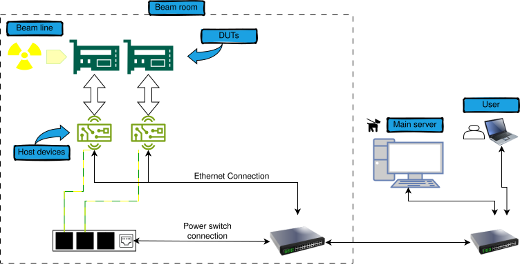

## Radiation setup helpers

This GitHub contains a set of tools that can help you perform a radiation electronic device test.

<!DOCTYPE html>
<html lang="en">
<head>
  <title>RadHelper tools usage overview</title>
  
</head>
<body>
  
  
</body>
</html>